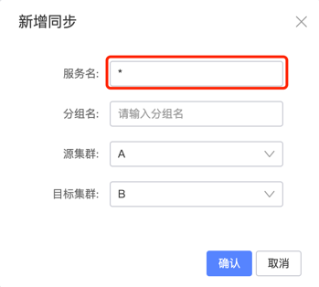
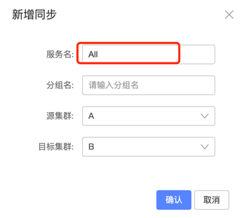

# Nacos Sync

## [Example](https://github.com/paderlol/nacos-sync-example)

## Function

 - Console: provide API and console for management
 - Worker: provide the service registration synchronization. 

## Architecture

### Architecture Topology


```
            +-------------+
     +----> |NacosClusterA|
     |      +-------------+               +-------------+
     |                                    |NacosClusterB|
Pull |                                    +--+----------+
Info |      +------------+                   ^
     |      |ZooKeeper   |                   |
     |      +--+---------+                   | Push Info
     |         ^ Pull Info                   |
     |         |                             |
     |        ++-----------------------------+--+
     <--------+  NacosSync1, NacosSync2,....    |
              +---+-------------------------+---+
                  |                         |
                  |                         |
                  |                         |
                  |       +---------+       |
                  +-----> |NacosSync| <-----+
                          |Database |
                          +---------+
```

### Architecture HighLights

 - All registration information will be stored in NacosSync DB.
 - Multiple NacosSync instances will perform the same job.
     - Multiple NacosSync instances ensure high availability.
     - Multiple NacosSync instances performing the same job ensure the simplicity.
     - NacosCluster target will dedup the synchronization information from Nacos.
     

## Quick Start:
 - Swagger API: http://127.0.0.1:8083/swagger-ui.html#/
 - Web Console: http://127.0.0.1:8083/
 - Others: TBD

# NacosSync Migration User Guide

## Support migration type

| Source    | Target    | Support | Note                                                         |
| --------- | --------- | ------- | ------------------------------------------------------------ |
| Nacos     | Nacos     | Yes     | Only supports the same version of Nacos migration,**especially** the version of **0.8** migrates to 1.0 or above. |
| Nacos     | Zookeeper | Yes     | Only support registery center of **Dubbo**                   |
| Nacos     | Consul    | Yes     | Only support  registery center of **Spring Cloud**           |
| Nacos     | Eureka    | Yes     | Only support  registery center of **Spring Cloud**           |
| Zookeeper | Nacos     | Yes     | Only support registery center of **Dubbo**                   |
| Consul    | Nacos     | Yes     | Only support  registery center of **Spring Cloud**           |
| Eureka    | Nacos     | Yes     | Only support  registery center of **Spring Cloud**           |


## Manual Goal

- Start the NacosSync service
- Use a simple example to demonstrate how to migrate a Dubbo client registered in the Zookeeper Registry to the Nacos Registry

## Quick start with docker [Recommend]
if you already have a mysql server, just run following command with your db configs
```bash
docker run -it --rm -eSERVER_PORT=${YOUR_CUSTOM_PORT} \
     -e "DATASOURCE_URL=jdbc:mysql://127.0.0.1:3306/nacos_sync?characterEncoding=utf8" \
     -e DATASOURCE_USERNAME=${YOUR_USER_NAME} \
     -e DATASOURCE_PASSWORD=${YOUR_PASSWORD}  \
     nacos-sync
```

### Supported Envs
1. SERVER_PORT
admin server port, default is 8083

2. DATASOURCE_URL
datasource url, e.g. jdbc:mysql://127.0.0.1:3306/nacos_sync?characterEncoding=utf8

3. DATASOURCE_USERNAME 
datasource user name

4. DATASOURCE_PASSWORD
datasource password

## Manually build and deploy

### Prerequisites

Before you begin, install the following:

- 64bit OS: Linux/Unix/Mac/Windows supported, Linux/Unix/Mac recommended.
- 64bit JDK 11+: downloads, JAVA_HOME settings.
- Maven 3.5.2+: [downloads](https://maven.apache.org/download.cgi), [settings](https://maven.apache.org/settings.html).
- MySql 5.6.+

### Download & Build From Release

There are two ways to get NacosSync.

- Download run package
- Download source code from Github

``` xml

cd nacos-sync/
mvn clean package -U

```

The path to the target file:

``` xml

nacos-sync/nacossync-distribution/target/nacos-sync-0.5.0.tar.gz

```

After extracting the installation package, the directory structure:

``` xml

nacos-sync
├── LICENSE
├── NOTICE
├── bin
│   ├── nacosSync.sql
│   ├── shutdown.sh
│   └── startup.sh
├── conf
│   ├── application.properties
│   └── logback-spring.xml
├── logs
└── nacos-sync-server.jar

```

### Initialize The DB

The default is Mysql database, which can support other relational databases

- Build db schema, the default schema name nacos_sync.
- Tables do not need to be created separately, which is conducive to hibernate's automatic table creation function.
- If the automatic table creation fails, you can build the table nacosSync.sql, the table statement is in the bin folder.

### DB Configuration

In the bin folder, application.properties:

``` xml

spring.datasource.url=jdbc:mysql://127.0.0.1:3306/nacos_sync?characterEncoding=utf8
spring.datasource.username=root
spring.datasource.password=root

```

### Start Server

``` xml

$ nacosSync/bin:
sh startup.sh  start

```

### Admin Console

``` xml

http://127.0.0.1:8083/#/serviceSync

```

## Advanced Configuration

### Full Synchronization from Zookeeper to Nacos (Dubbo)
When “*” is entered in the “Service Name” field of this form, it will fully synchronize all services from Zookeeper to Nacos, but only when using Dubbo.


### Full Synchronization from Nacos to Nacos
When “All” is entered in the “Service Name” field of this form, it will automatically synchronize all registered services within the **default group** of the current cluster.

This description explains the functionality clearly for English-speaking users.
